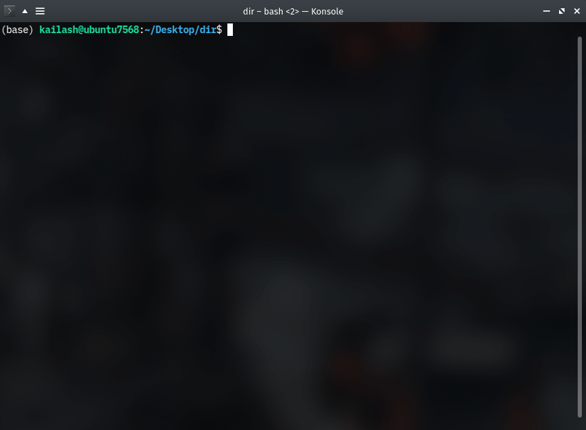

# mxcat
Command-line tool to concatenate MuseScore XML files (akin to UNIX cat behavior) while also generating individual parts on a finer staff-level basis.
* Merging was removed in MuseScore 3 because it was unstable, and there have been no successful attempts to revive it ([thread 1](https://musescore.org/en/node/291978), [thread 2](https://musescore.org/en/node/264845), [thread 3](https://musescore.org/en/node/264733), and so on... have been unsuccessful and lead to dead ends). 
* I'm not too familiar with the XML syntax that MuseScore uses, but I gave it my best shot, in case someone out there had the same problems I did.
* In general, mxcat will concatentate Musescore XML files and print on the standard output; `mxcat`
behaves similarly to UNIX `cat`, where you may redirect output to another file.
You can pipe to cat if you want access to `cat`-like options (such as -n, -v,
and so on)
* Keep in mind that parsing multiple large mscx files will certainly take some time.
* `mxcat` does not (yet) have functionality to connect slurs and ties over different scores. If staff count is not constant over all files, you may find unexpected concatenation due to ambiguity while merging. 

<p align="center">
  
  </br>
  <i>Sample usage</i>
</p>

## Sample usage:

Concatenate `file0.mscx`, `file1.mscx`, and `file2.mscx`, and redirect output to `result.mscx`:        
```bash
python mxcat.py file*.mscx > result.mscx
```

Concatenate several files, but only keep the first 2 staves.
```bash
python mxcat.py file*.mscx --staff 1 2 --debug > result.mscx
```

View help message:        
```bash
python mxcat.py -h | less 
```

Numbered lines:           
```bash
python mxcat.py file*.mscx | cat -n | less -S
```

Search debug comments:    
```bash
python mxcat.py out*.mscx --debug true | grep "\[DEBUG\]"
```
